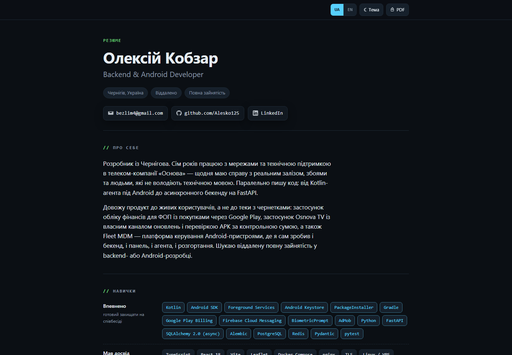

# Portfolio — Oleksii Kobzar

Backend & Android developer from Chernihiv, Ukraine. Seven years of hands-on work
with networks and technical support at the telecom company Osnova; alongside that
I ship my own products to real users — from Kotlin apps in production to async
FastAPI backends and full Next.js web apps.

These are projects I designed and built myself: backend, client, database,
deployment. Below is what each one does, how it works inside, and what it is built
with. The source lives in private repositories; here you get the description and
the screenshots.

🇺🇦 Українська версія: [README.md](README.md)

---

## Projects

| Project | What it is | Stack |
|---|---|---|
| [HelpLoop](#helploop) | Q&A community for IT people, in production | Next.js 15, React 19, TypeScript, PostgreSQL, Prisma |
| [FOP Finance](#fop-finance) | Finance app for sole proprietors, on Google Play | Kotlin, Jetpack Compose, Room, Play Billing |
| [Osnova TV](#osnova-tv) | IPTV client with its own update channel | Kotlin, Compose, libVLC, FCM + Python backend |
| [Tabel](#tabel) | Shift schedule and payroll | Kotlin, Compose, Glance widget |
| [fb2 Home Library](#fb2-home-library) | Book catalog + Telegram Mini App | Python, FastAPI, aiogram, SQLite |
| [SQLi Scanner](#sqli-scanner) | SQL-injection testing for your own sites | Python (stdlib), Telegram bot |
| [Upwork Copilot](#upwork-copilot) | Upwork job scoring and triage | Python, IMAP, feedparser |
| [Résumé site](#résumé-site) | Personal page, UA/EN | HTML, CSS, JS |

---

## HelpLoop

A Q&A community for IT people: ask what you are stuck on, answer what you have
already solved. Ukrainian interface, English codebase. In production.

| | | |
|---|---|---|
|  |  |  |

**What it does.** Questions and answers with markdown, syntax highlighting, tags,
comments, voting, accepted answers and a reputation ledger. Accounts with email
confirmation, password reset, session management and self-service deletion.
Full-text search on a PostgreSQL index. Moderation: report queue, close/reopen,
soft delete with restore, account suspension. An `/admin` panel for users,
content, tags and an append-only audit log.

**How it works.** Next.js 15 with the App Router: pages render on the server and,
instead of a separate API, it uses server actions. Auth is hand-rolled — opaque
server-side sessions revocable in one `DELETE`, with no dependency on a beta auth
library. Passwords use `scrypt` from Node's standard library (memory-hard, and no
native module to break the Alpine/Windows build split). Anti-bot is a self-hosted
Altcha proof of work — no third party, no tracking. Search runs on a `simple`
dictionary index: Postgres ships no Ukrainian stemmer, and the English one
produces wrong matches in both directions.

**Stack.** Next.js 15 (App Router), React 19, TypeScript (strict), PostgreSQL 16
+ Prisma, Tailwind CSS v4, remark/rehype for markdown, highlight.js, zod, sharp,
Resend (email over HTTP API), Caddy, Docker Compose.

---

## FOP Finance

An offline finance app for Ukrainian sole proprietors and small companies: income
and expenses, taxes across seven tax regimes, profitability analytics, a hiring
calculator and a payment calendar. Shipped on Google Play with in-app purchases.

| Overview | Analytics | Hiring calculator |
|---|---|---|
|  |  |  |

| Calendar | Regime comparison |
|---|---|
|  |  |

**What it does.** Income and expenses with categories, foreign-currency operations
with an automatic NBU exchange rate for the date, recurring templates. Accounts
with balances, clients and invoices with PDF, a quarterly income ledger. Seven tax
regimes, each with its own payment schedule, limits and over-limit warnings.
Analytics: margin, profitability, break-even point, cash-flow forecast, comparison
against the industry. A hiring calculator (staff / Diia.City / contractor) and a
calendar of payment due dates.

**How it works.** Local-first by design: every financial record stays in an
on-device database and never leaves it — no server means nothing to leak. The only
network call is the NBU rate for the date of a currency operation. Sign-in is
protected by biometrics and an access code stored only as an irreversible hash.
Recurring payments and reminders run in the background on WorkManager.

**Stack.** Kotlin, Jetpack Compose (Material 3), Navigation Compose, Room,
WorkManager, AndroidX Biometric, DocumentFile, Google Play Billing, AdMob +
User Messaging Platform (ad consent).

---

## Osnova TV

An Android client for a cable operator's subscribers: personal account, payment,
IPTV. Distributed as its own APK with a separate update channel — no Google Play.

| Sign in | Account | Payment history |
|---|---|---|
|  |  |  |

| Tariffs | IPTV | Extra services |
|---|---|---|
|  |  |  |

> On the account screen the account number, full name, login, address and IP are
> blurred — this is a real subscriber's data.

**What it does.** Sign-in to the personal account, balance and tariffs, IPTV
channels with an electronic program guide, and account-balance reminders. The app
reads the account data off the operator's web page, parsing the HTML — the operator
exposes no API.

**How it works.** The Compose client parses the personal account with jsoup, pulls
the playlist (M3U) and the program guide (XMLTV), and plays the streams through
libVLC. Firebase Cloud Messaging handles notifications; the token is stored
encrypted (EncryptedSharedPreferences). A separate Python backend (aiohttp +
aiogram) receives device registrations, sends push through firebase-admin and
serves the APK. There are no Google Play auto-updates, so the update channel is
custom: `version.json` returns the version and a link, and the app verifies the
downloaded APK against a SHA-256 checksum before installing — so a tampered file
cannot be slipped in.

**Stack.** Kotlin, Jetpack Compose (Material 3), jsoup, OkHttp, libVLC
(`org.videolan.android:libvlc-all`), Firebase Cloud Messaging, AndroidX
Security-Crypto, Biometric, WorkManager. Backend: Python, aiohttp, aiogram,
firebase-admin, SQLite, Caddy.

---

## Tabel

An Android app that reads a work schedule from a Google Sheet and shows who is on
shift with you on a given day, and computes the month's pay. Built for a specific
rotation: 24-hour shifts every third day, the rest of the team on floating 8- and
11-hour shifts.

| Shift | Month | People |
|---|---|---|
|  |  |  |

| Totals | Payroll |
|---|---|
|  |  |

> Coworkers' surnames and the amounts in the screenshots are blurred — this is real
> data from the sheet.

**What it does.** For a chosen date it shows your status and everyone working that
day, grouped by shift type. A calendar of the schedule with a monthly summary. The
team list browsable by month, with a forecast for months not yet in the sheet.
Totals for the year and for all time: hours, 24-hour shifts, days off, who you
share shifts with most. Payroll with the formula explained and a 12-month history.
Notifications on shift days and a home-screen widget with today's status.

**How it works.** The data source is the timesheet Google Sheet; the app reads it
and lays out the "24h every third day" rotation. For future months not yet in the
sheet, the roster and shifts are forecast from the rotation. The home-screen widget
is built on Glance. Notifications run on WorkManager.

**Stack.** Kotlin, Jetpack Compose (Material 3), Glance (widget), WorkManager,
Lifecycle ViewModel. No backend — it reads the sheet directly.

---

## fb2 Home Library

Catalogs a local folder of books, works out series and volume versions on its own,
and packs archives. Managed through a Telegram Mini App, a bot, or a CLI. The data
source is only your files on disk — nothing is downloaded anywhere.

| Mini App | CLI |
|---|---|
|  |  |

**What it does.** Reads metadata from the fb2 files themselves (author, series,
volume number, annotation, cover), transparently unpacking `.fb2.zip`. Merges
series broken apart by messy data. From several copies of one volume it keeps the
current one — by date and size — and marks the rest stale without deleting them.
Shows gaps in numbering. Packs a ZIP of the whole library, a series or an author,
splitting it under Telegram's file limit.

**How it works.** The core is a Python library with a CLI (`scan`, `stats`,
`series`, `duplicates`, `pack`). A repeat `scan` re-reads only changed files. On
top of it sit a Telegram bot on aiogram and a web app (Mini App) on FastAPI, both
working against the same catalog. Metadata is cached in SQLite.

**Stack.** Python, FastAPI + uvicorn (Mini App), aiogram (bot), SQLite, a custom
fb2/`.fb2.zip` parser.

---

## SQLi Scanner

A toolkit for a site owner to test their own resources for SQL injection and
understand how to fix it. Deliberately fenced: your own sites only, or with written
permission.

| HTML report |
|---|
|  |

**What it does.** Detects SQL injection of three kinds: error-based (from a database
error appearing), boolean-based blind (from the difference between responses to a
true and a false expression) and time-based blind (from an injected delay). It
tests different vectors — URL parameters, form fields, headers, cookies, path.
It identifies the DBMS (MySQL/MariaDB, PostgreSQL, MS SQL, Oracle, SQLite) and
tailors payloads to it. Reports in HTML and JSON. A separate `REMEDIATION.md`
explains how to close each hole, with code examples in Java, PHP and Node.js.

**How it works.** Pure Python 3 with no external dependencies — the standard
library is enough. It ships a deliberately vulnerable mini-site to prove the
scanner works. Runs from a CLI, an auto-launch menu script, or a Telegram bot. A
"smart engine" tells a real DBMS error in the response apart from ordinary text.

**Stack.** Python 3 (stdlib only), a Telegram bot on the raw Bot API.

---

## Upwork Copilot

A set of Python scripts to find, score and triage Upwork jobs for a Python /
automation / API stack. Collects jobs, scores relevance and drafts cover letters.

| CLI |
|---|
|  |

**What it does.** Collects jobs from Upwork email alerts (over IMAP), from local
files, and through a Telegram bot. Computes a 1–10 match score against your
keywords, with a breakdown of where the score comes from. Catches red flags (unpaid
tests, unrealistic budgets) and off-stack work. Stores everything in JSON or SQLite.
Generates a personalized cover letter per job on a Hook → Solution → CTA structure.
Works both through CLI commands and an interactive menu.

**How it works.** The core is pure Python 3.8+ — without dependencies it falls back
to `urllib` + `xml.etree`; `feedparser` and `requests` make feed handling more
robust but are optional. Scoring is transparent: every point is visible in a
per-rule breakdown (`+6 python_core`, `+7 bots`, `+3 budget`).

**Stack.** Python 3.8+, IMAP (email alerts), feedparser + requests (optional),
Telegram Bot API, JSON/SQLite.

---

## Résumé site

A personal résumé page: bilingual (UA/EN), dark and light themes, print to PDF.
A single HTML file with no build step and no dependencies.

| Page |
|---|
|  |

**How it works.** Plain HTML/CSS/JS, no frameworks. Language and theme switching
runs on CSS variables and attributes, with no reload. A separate print stylesheet
(`@media print`) expands links and strips the chrome to print a clean PDF résumé.
Deployed on GitHub Pages.

**Stack.** HTML, CSS (custom properties), vanilla JavaScript.
