# Портфоліо — Олексій Кобзар

🇬🇧 [English version](README.en.md)

---

## Що тут є

| Проект | Опис | Стек |
|---|---|---|
| [HelpLoop](#helploop) | Q&A-спільнота для айтівців, працює | Next.js 15, React 19, TypeScript, PostgreSQL |
| [ФОП Фінанси](#фоп-фінанси) | Облік фінансів ФОП, є в Google Play | Kotlin, Compose, Room |
| [Osnova TV](#osnova-tv) | Клієнт кабельного оператора + IPTV | Kotlin, Compose, libVLC + Python |
| [Табель](#табель) | Графік змін і зарплата з Google-таблиці | Kotlin, Compose, Glance |
| [Бібліотека fb2](#бібліотека-fb2) | Каталог книг + Telegram Mini App | Python, FastAPI, aiogram |
| [SQLi-сканер](#sqli-сканер) | Перевірка своїх сайтів на ін'єкції | Python, чистий stdlib |
| [Upwork Copilot](#upwork-copilot) | Оцінка вакансій Upwork | Python, IMAP |

---

## HelpLoop

Місце, де люди з ІТ допомагають одне одному: питаєш, на чому застряг, відповідаєш на
те, що вже сам колись вирішував. Інтерфейс український.

| | | |
|---|---|---|
| 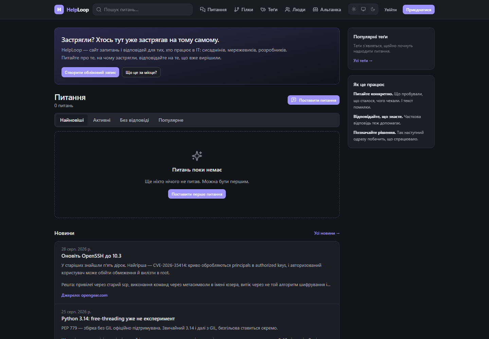 | 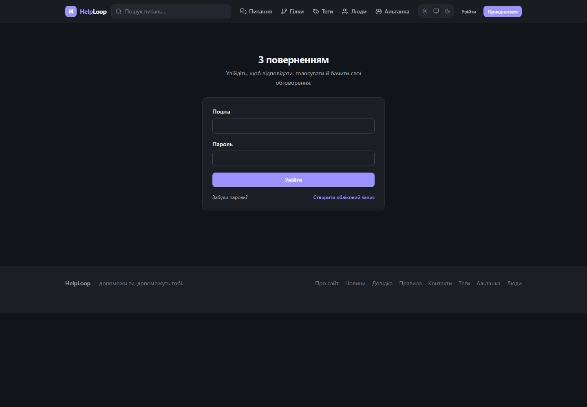 | 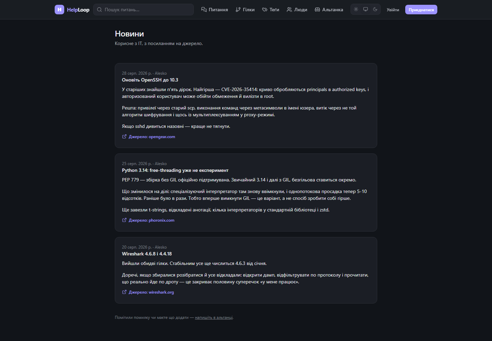 |

Питання й відповіді з markdown і підсвіткою коду, теги, коментарі, голосування,
прийняті відповіді, репутація. Акаунти з підтвердженням пошти й скиданням пароля,
модерація зі скаргами й м'яким видаленням, окрема адмінка на `/admin`, де все
робиться вручну, кожна дія лягає в журнал, який не можна переписати.

Зроблено на Next.js 15 з App Router: сторінки збираються на сервері, а замість
окремого API — server actions. Авторизацію писав сам — серверні сесії, які гасяться запитом до бази. Паролі — на `scrypt` зі стандартної бібліотеки Node. Від
ботів — Altcha замість капчі. Пошук — на `simple`-словнику
Postgres, бо готового українського стемера в ньому немає.

**Стек:** Next.js 15, React 19, TypeScript, PostgreSQL + Prisma, Tailwind v4,
remark/rehype, Resend, Caddy, Docker Compose.

---

## ФОП Фінанси

Рахує гроші українського ФОП: доходи й витрати, податки за сімома системами,
рентабельність, найм, календар платежів. Опублікований у Google Play.

| Облік | Аналітика | Найм |
|---|---|---|
| 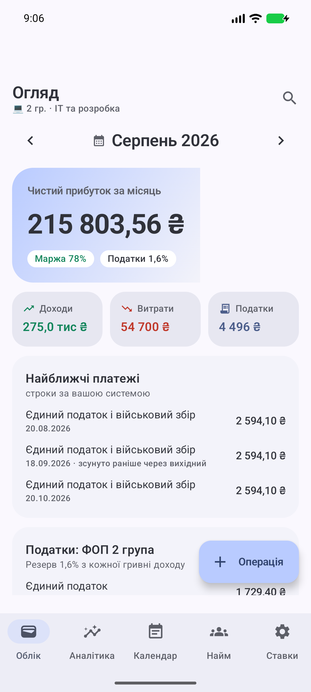 | 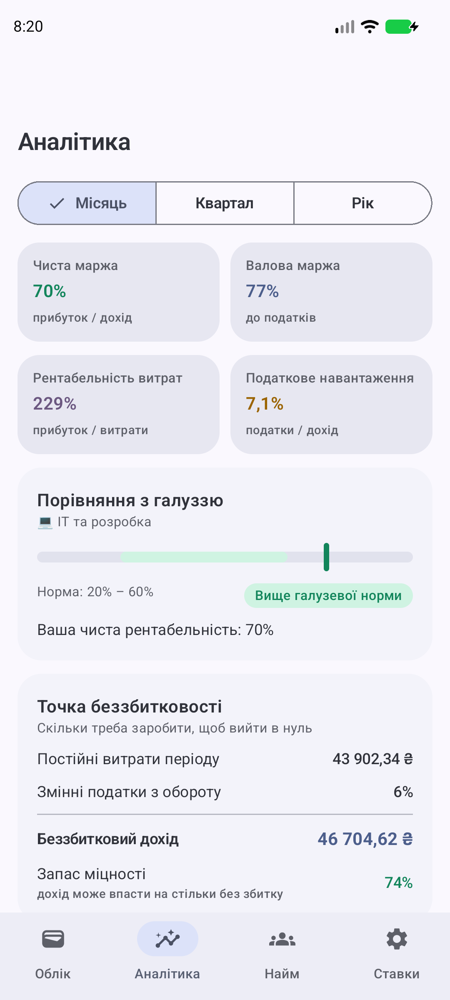 | 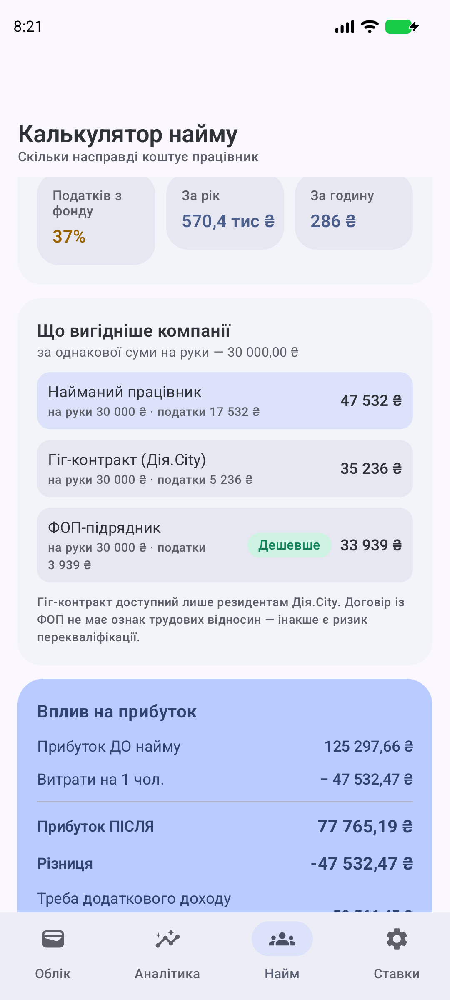 |

| Календар | Порівняння систем |
|---|---|
| 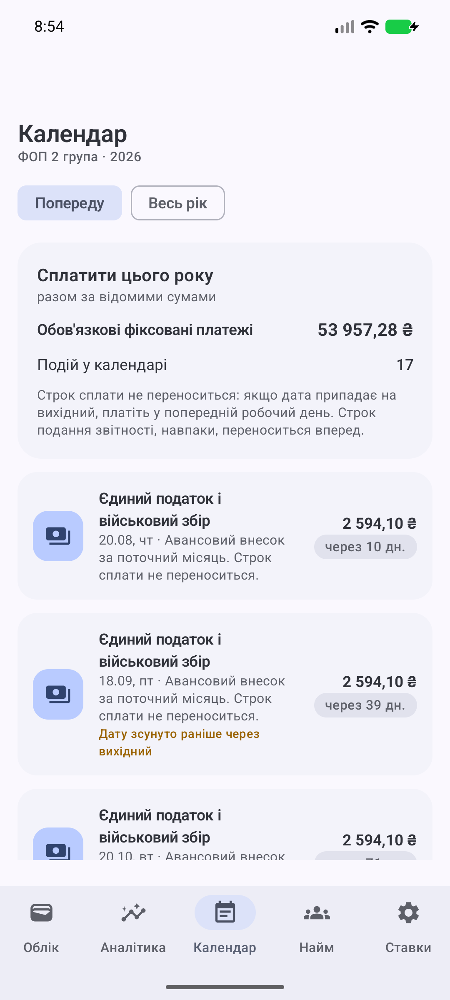 | 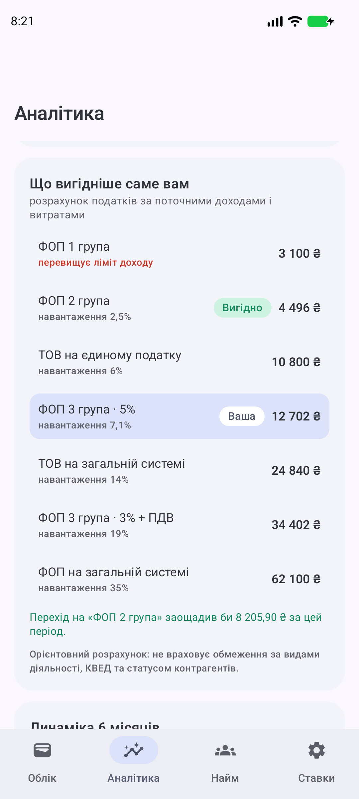 |

Валютні операції самі тягнуть курс НБУ на поточну дату, а регулярні платежі підставляються
щомісяця. Сім систем оподаткування, у кожної свій розклад, ліміти й попередження про
перевищення. Аналітика рахує маржу, точку беззбитковості, прогноз потоку й порівнює
з галуззю. Калькулятор найму показує, що вигідніше — штат, Дія.City чи ФОП-підрядник —
за однакової суми на руки. У календарі строки сплати саме за твоєю системою.

Уся база лежить на телефоні й працює офлайн. Єдиний раз, коли застосунок підключається до
мережі, — курс НБУ. Вхід за біометрією або кодом, який зберігається лише хешем.

**Стек:** Kotlin, Jetpack Compose, Room, WorkManager, Biometric, Google Play Billing,
AdMob.

---

## Osnova TV

Застосунок для абонентів кабельного оператора: кабінет, баланс, оплата, IPTV. У
Google Play його немає — роздається власним APK.

| Вхід | Кабінет | Фінанси |
|---|---|---|
| 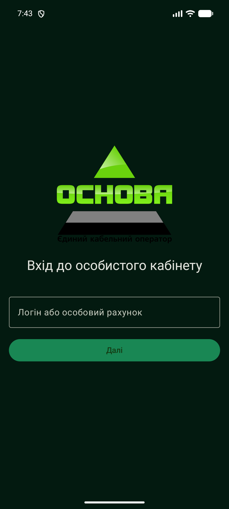 | 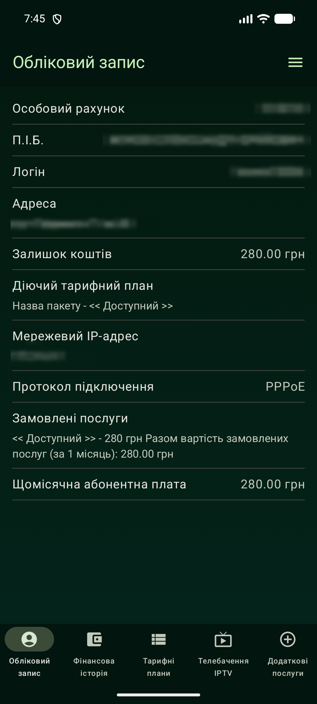 | 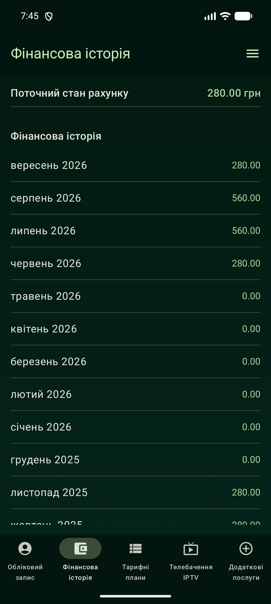 |

| Тарифи | IPTV | Послуги |
|---|---|---|
| 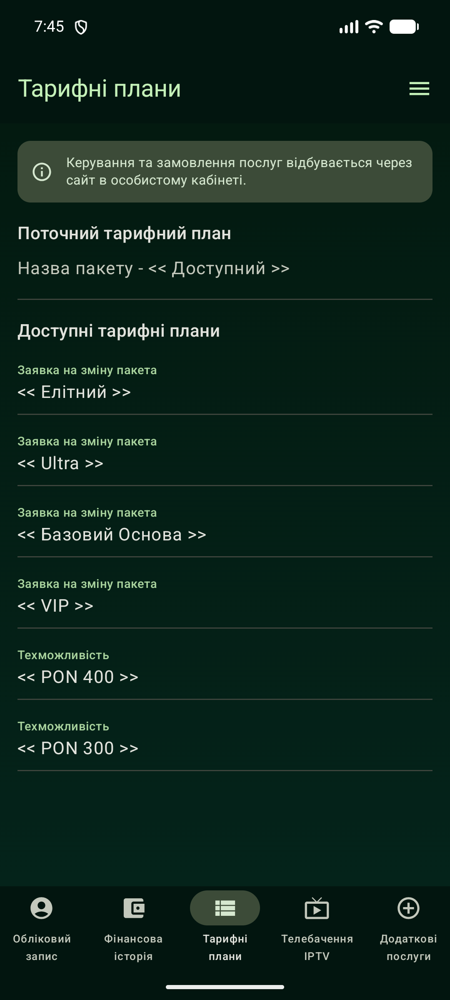 | 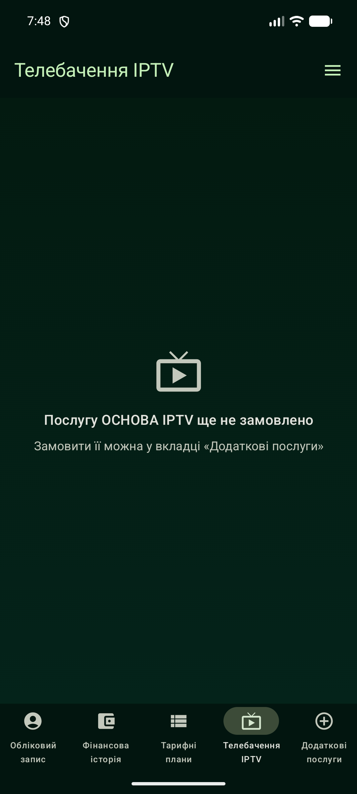 | 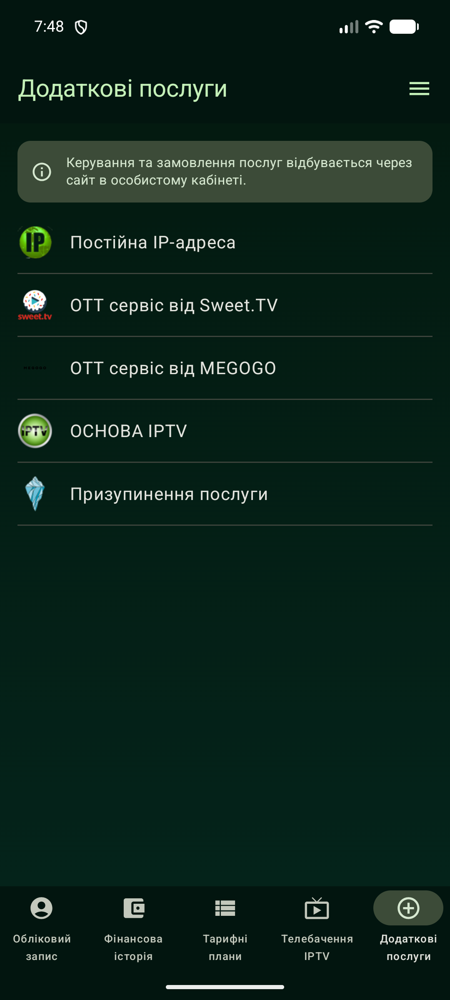 |

Доступу до API провайдера немає, тож дані кабінету застосунок дістає прямо з його
вебсторінки — розбирає HTML через jsoup. Плейлист і програму передач отримує у форматах
M3U та XMLTV, канали працюють через libVLC. Сповіщення — через Firebase, токен зашифрований.

Бекенд на Python (aiohttp + aiogram): приймає реєстрації пристроїв, відправляє
пуші й роздає APK. Оновлень із Google Play немає, тож канал свій: `version.json` повідомляє,
яка версія свіжа, а застосунок перед установкою звіряє завантажений файл за SHA-256.

**Стек:** Kotlin, Compose, jsoup, OkHttp, libVLC, Firebase Cloud Messaging,
Security-Crypto. Бекенд — Python, aiohttp, aiogram, SQLite, Caddy.

---

## Табель

Читає робочий табель із Google-таблиці й показує, хто з тобою на зміні цього дня та
скільки вийде зарплати за місяць. Писав під конкретний графік у себе на роботі: доба
через дві, решта колективу — плаваючі зміни по 8 і 11 годин.

| Зміна | Місяць | Люди |
|---|---|---|
| 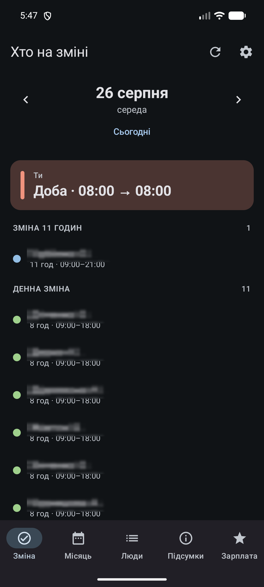 | 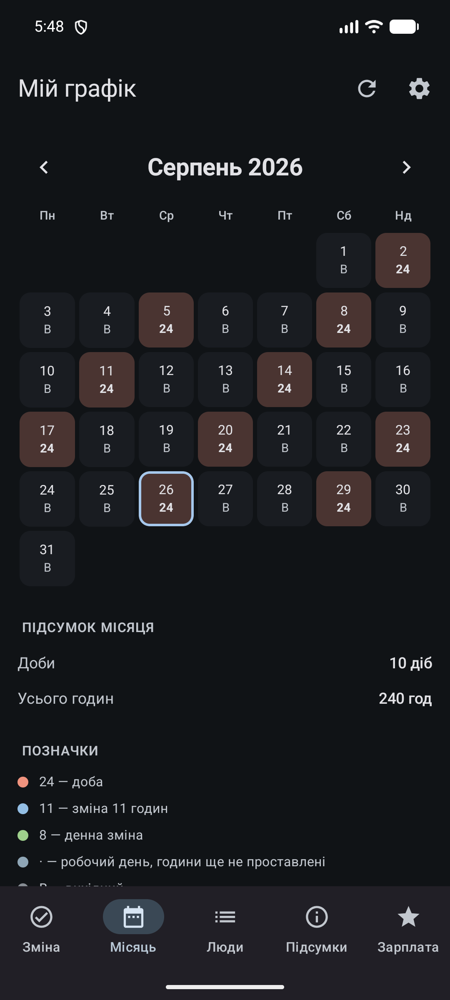 | 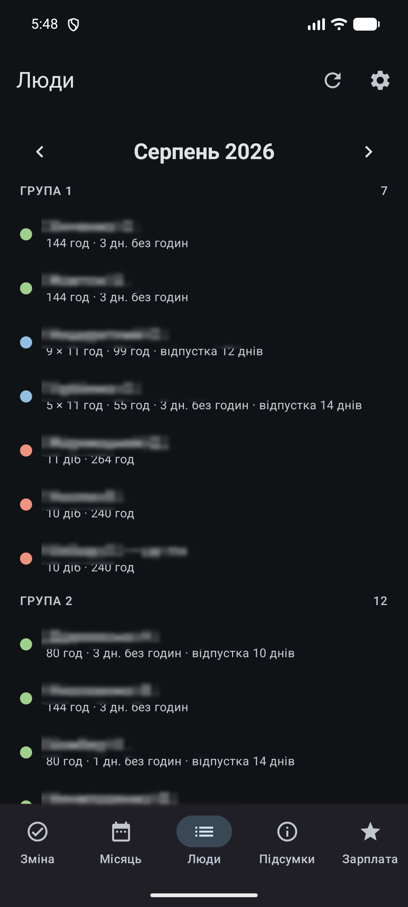 |

| Підсумки | Зарплата |
|---|---|
| 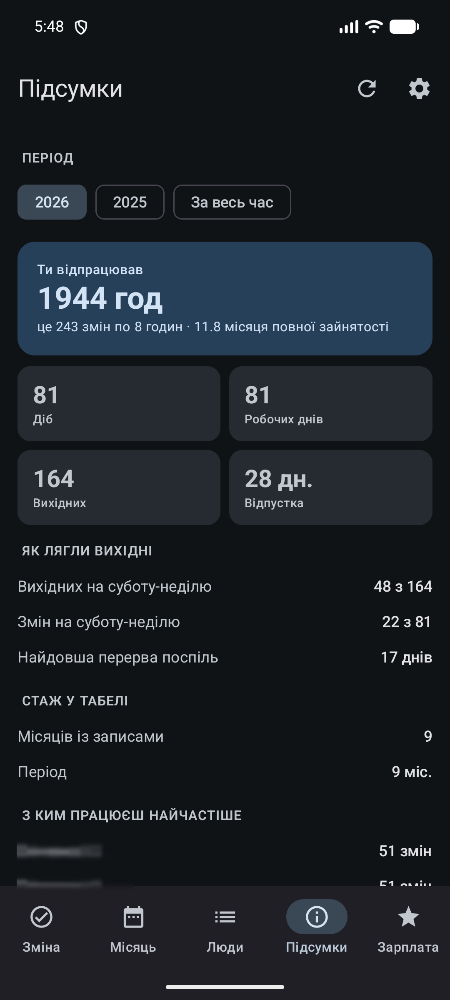 | 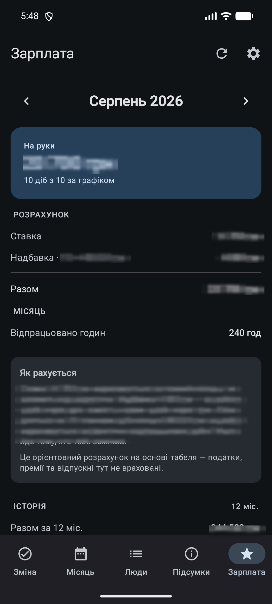 |

На конкретну дату показує обраний статус і всіх, хто працює того ж дня, за типами змін. Є календар
місяця, список колективу, підсумки за рік і за весь час — години, доби, з ким
найчастіше збігаєшся. Зарплата рахується з поясненням формули й історією за 12
місяців. Для місяців, яких ще немає в таблиці, склад і зміни добираються прогнозом за
ротацією. На головному екрані живе віджет зі статусом на сьогодні.

Бекенду нема — застосунок читає таблицю напряму.

**Стек:** Kotlin, Compose, Glance (віджет), WorkManager.

---

## Бібліотека fb2

Наводить лад у папці з книгами: сам розбирається, де яка серія і який том свіжіший,
і збирає з цього архіви. Керувати можна з Telegram Mini App, бота або з консолі. Працює тільки з тими файлами, що вже лежать у тебе.

| Mini App | Консоль |
|---|---|
| 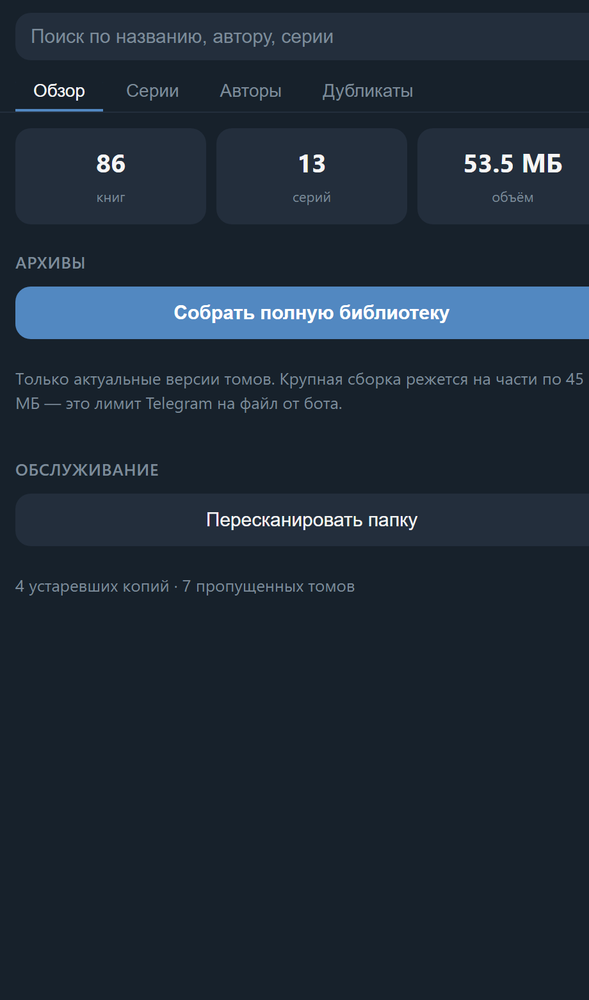 | 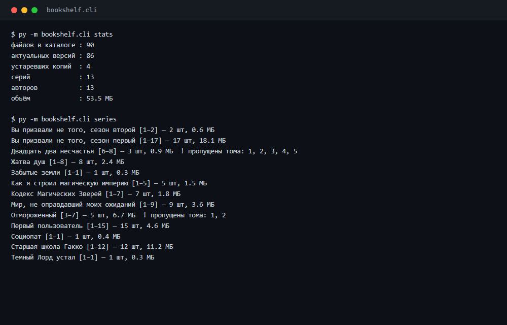 |

Метадані читає з самих fb2, розпаковуючи `.fb2.zip`. Зводить докупи серії, побиті різнобоєм у назвах. З кількох копій одного тому лишає свіжу, за датою й обсягом, а решту позначає застарілими. Показує, яких томів у серії бракує. Збирає ZIP по всій бібліотеці, серії чи автору й ріже його на частини під
ліміт Telegram.

Ядро — Python-бібліотека з консольними командами; повторне сканування перечитує лише те,
що змінилося. Поверх — бот на aiogram і Mini App на FastAPI, обидва працюють в одному
каталозі, метадані кешуються в SQLite.

**Стек:** Python, FastAPI, aiogram, SQLite, свій парсер fb2.

---

## SQLi-сканер

| Звіт |
|---|
| 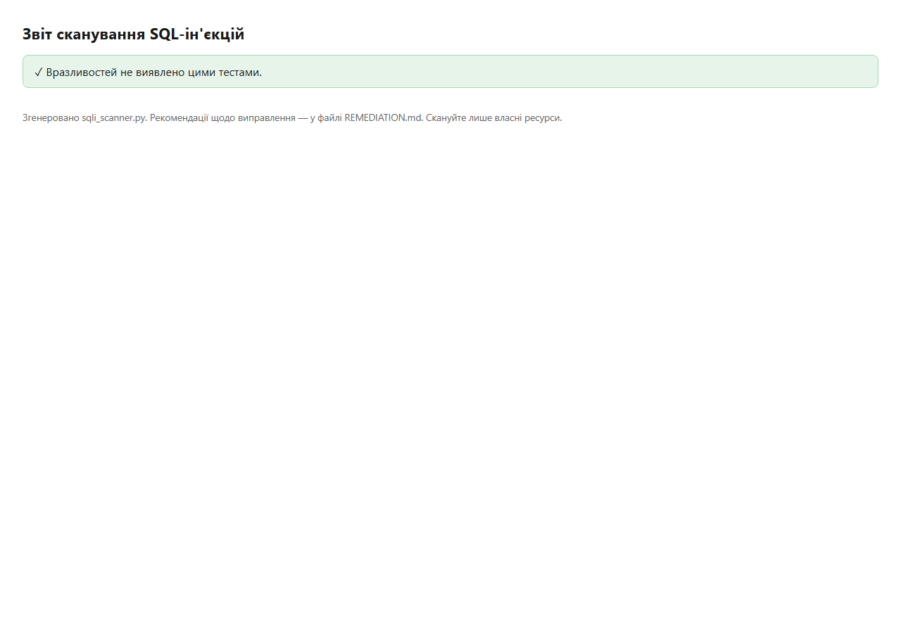 |

Ловить три типи ін'єкцій: коли в відповідь падає помилка СУБД, коли сайт по-різному
відповідає на істинний і хибний вираз, і коли видає себе штучною затримкою. Перевіряє
параметри URL, поля форм, заголовки, cookie й шлях. Впізнає СУБД — MySQL, PostgreSQL,
MS SQL, Oracle, SQLite — і підбирає під неї пейлоади. Звіт кладе в HTML і JSON, а
поруч є `REMEDIATION.md` із прикладами, як закрити діру на Java, PHP і Node.

Написаний на чистому Python 3, без жодної зовнішньої залежності. У комплекті —
навмисно вразливий тестовий сайт, на якому видно, що сканер справді щось знаходить.
Запускати можна з консолі, через меню або з Telegram-бота.

**Стек:** Python 3 (лише stdlib), Telegram-бот на голому Bot API.

---

## Upwork Copilot

Набір скриптів для Upwork: збирає вакансії, оцінює, наскільки вони підходять, і пише під них супровідні листи. Заточений під Python, автоматизацію й API.

| Консоль |
|---|
| 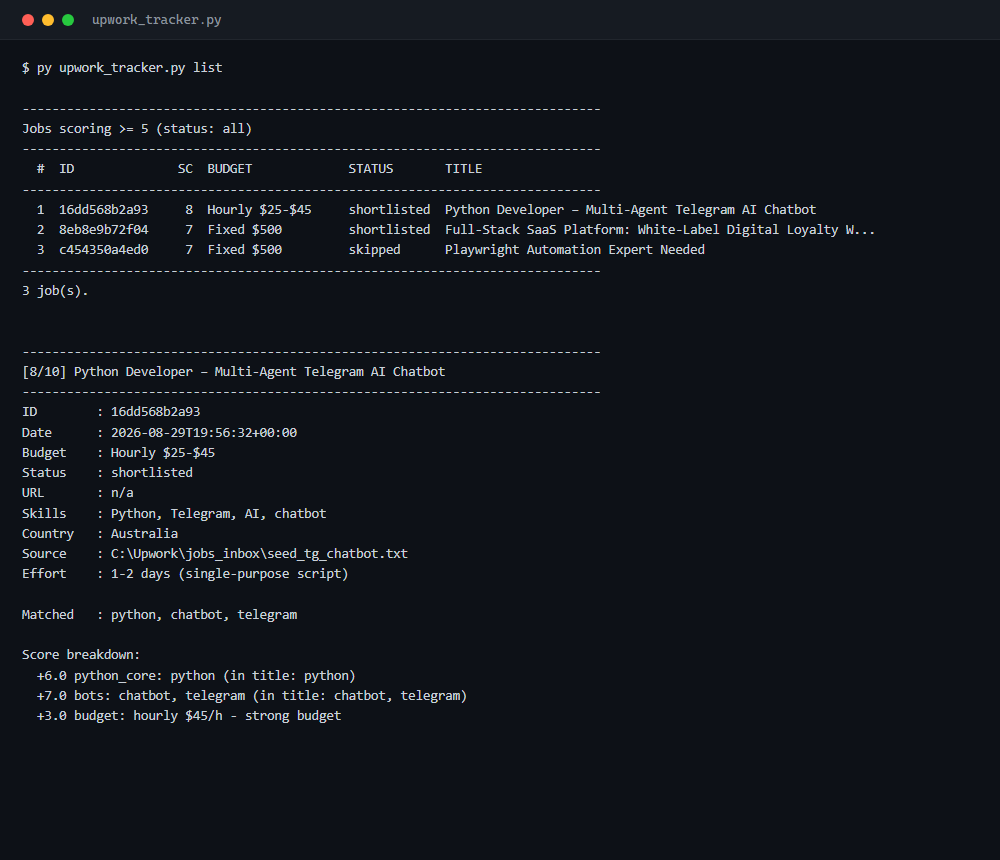 |

Вакансії отримує з email-алертів Upwork по IMAP, з локальних файлів і через Telegram-бот. Кожній ставить оцінку від 1 до 10 і показує, звідки вона. Відсіює червоні прапорці — безоплатні тести, нереальні бюджети, не твій стек. Під конкретну вакансію генерує лист. Зберігає все в JSON або SQLite, працює і командами, і через меню.

Ядро — чистий Python 3.8+: без залежностей падає на `urllib`, з `feedparser` і
`requests` — надійніше, але вони не обов'язкові. Кожен бал видно в розбивці за
правилами — зрозуміло, звідки взялась оцінка.

**Стек:** Python 3.8+, IMAP, feedparser + requests (за бажанням), Telegram Bot API,
JSON/SQLite.
